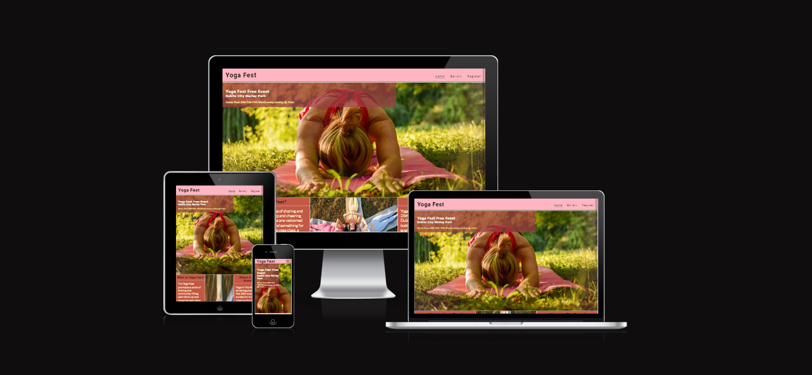
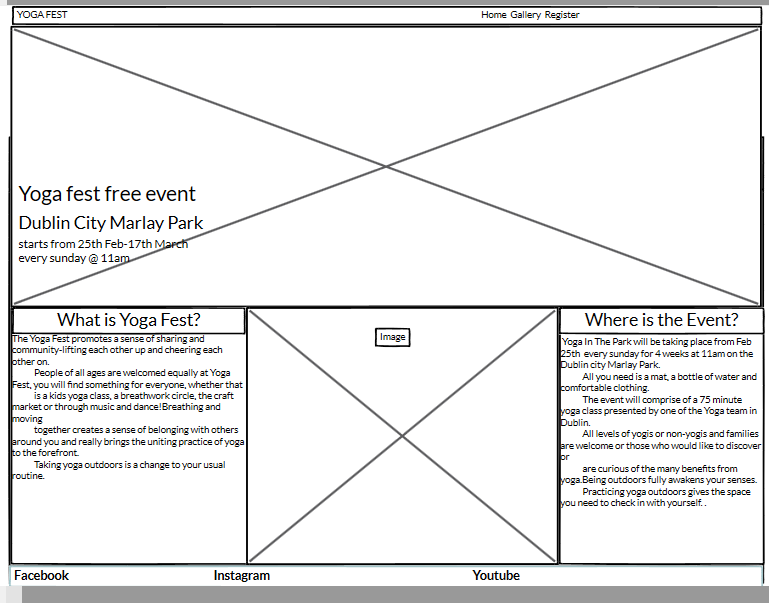
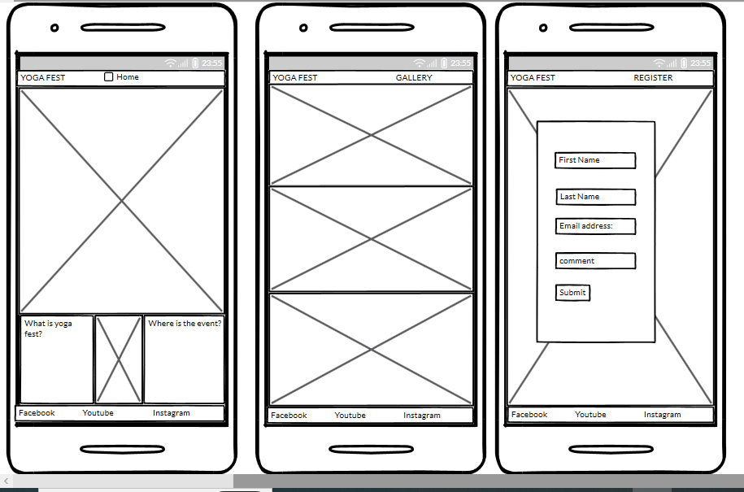
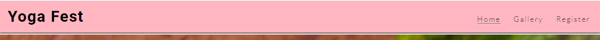

# YOGA FEST
Milestone project one :Code Institute

This is a yoga fest free event website that helps people to get motivated to do yoga indoor and outdoor for healthy life. The website includes information regarding event like dates,times and location.In this website timing place are provided and also gallery photos which help user to make decsion and register for the event.

## Contents
1.[Design](#design)
2.[Features](#features)
3.[UX](#ux)
4.[Testing](#testing)
5.[Sources](#sources)
6.[Credits](#credits) 

## Design
This site is created  for the yoga festival were the user can register and join the event.Inspired by the Love Running walkthrough project i built Yoga Fest website.

### Wireframe Designs
The wireframes were made with using balsamiq which helped visualise the website.

### Font Choices
**Fonts:**'Lato' was chosen for the body of the website as it makes the website have a professional look while also maintaining the usefulness of the website.
'Roboto' was chosen for the heading sections of the website maintaining a professional look.

### Color choices
**Colours**The color used are lightpink,gray,#3a3a3a etc.The lightpink base colour was picked out to help give contrast to the hero image and most colors used are builtin colors.

### Images
**Images:** The mosr of the images are used from Pexels and Freepik.

## Features
The site has features of a static website.
 -**Nav Bar**
    - The navigation bar is always visible on all pages. In the top right corner are Home,Gallery,Register.
    - The currently active page is underlined in the header.
    - Regardless of the screen format, the navigation bar is constant in one line while being spaced out.
    

 -**Hero Image**
 - The hero image was chosen as i wanted something with a yoga posture with natural background.The image make the users want to scroll down the home page.
 
 

