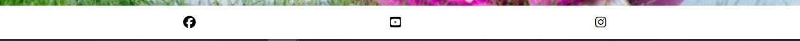

# YOGA FEST
Milestone project one :Code Institute

This is a yoga fest free event website that helps people to get motivated to do yoga indoor and outdoor for healthy life. The website includes information regarding event like dates,times and location.In this website timing place are provided and also gallery photos which help user to make decsion and register for the event.

## Contents
1. [Design](#design)
2. [Features](#features)
3. [UX](#ux)
4. [Testing](#testing)
5. [Sources](#sources)
6. [Credits](#credits) 

## Design
This site is created  for the yoga festival were the user can register and join the event.Inspired by the Love Running walkthrough project i built Yoga Fest website.

### Wireframe Designs
The wireframes were made with using balsamiq which helped visualise the website.

### Font Choices
**Fonts:**'Lato' was chosen for the body of the website as it makes the website have a professional look while also maintaining the usefulness of the website.
'Roboto' was chosen for the heading sections of the website maintaining a professional look.

### Color choices
**Colours**The color used are lightpink,gray,#3a3a3a etc.The lightpink base colour was picked out to help give contrast to the hero image and most colors used are builtin colors.

### Images
**Images:** Most of the images are used from Pexels and Freepik website.
[www.freepik.com](https://www.freepik.com)
[www.pexels.com](https://www.pexels.com/)

## Features
The site has features of a static website.
- **Nav Bar**
    - The navigation bar is always visible on all pages. In the top right corner are Home,Gallery,Register.
    - The currently active page is underlined in the header.
    - Regardless of the screen format, the navigation bar is constant in one line while being spaced out.
    

 -**Hero Image**
 - The hero image was chosen as i wanted something with a yoga posture with natural background.The image make the users want to scroll down the home page.
 

 - **Main Section**
    - Headers on all pages to help TO give the content to the users on each page.
    - Content in the home page,it describes about why yoga is necessary when and where the event is taking place.
    - Information kept short to help the user find information quickly.

- **Home page**

    - The lightpink greets the user to give them a attractive,warm, calm welcome.
    - The layout is vertical on smaller screens and horizontal to make use of the larger screens such as laptops.

    

- **Gallery Page**

   - The gallery page contains pictures of yoga event.Pictures were used from Pexel and Freepik site.
   - The layout is vertical on smaller screens and horizontal to make use of the larger screens such as laptops.

   

- **Register page**

    - The register page encourages user to register and leave a comment if they need any information.
    - The image on the register page helps to make the users smile as the image is a yogini posing with a smile in nature it greets user with calm welcome.

   

- **Footer**
    - The footer contains three icons which link to external social media pages.
    - The links will open in new tabs to allow the user easy access to come back to the site.
    - The footer is consitant throughout each page.

    

    ###  Potential Future Features
     - add another page to include videos
        Another page to include lifehack videos would improve the website and it would give the brain a break from reading.

    ## UX
    ### Site Goals
    The site wants to attract people who want to learn yoga as a beginner and who do yoga indoors can come and do yoga in nature outdoors.

    ## Testing
    - I confirmed that the header and navbar are easily readable and understandable.
    - I have confirmed that this project is responsive and looks good on various common screen sizes by using the chrome devtools devices toolbar.
    - I have also confirmed that the form works and each field is required. There are also messages that pop up if a field is left blank or if it is filled incorrectly.
    
    ### Fixed Bugs
    -Syntax error in the register.html section forget to put double quotes in the submit button this caused no pop up message if the field is submited without filling anything the First name,Last name,email field.

    ### Unfixed Bugs
    - None.
    
    ### Validation Testing
   - HTML ([W3C Validator](https://validator.w3.org/))
    - 1 error found in the index page didn't used ""(inverted commas) in the img src,alt.I didnt closed the alt ="group of women outdoor fitness".
    - Solution: added the .inverted commas to alt ="".
    

    

